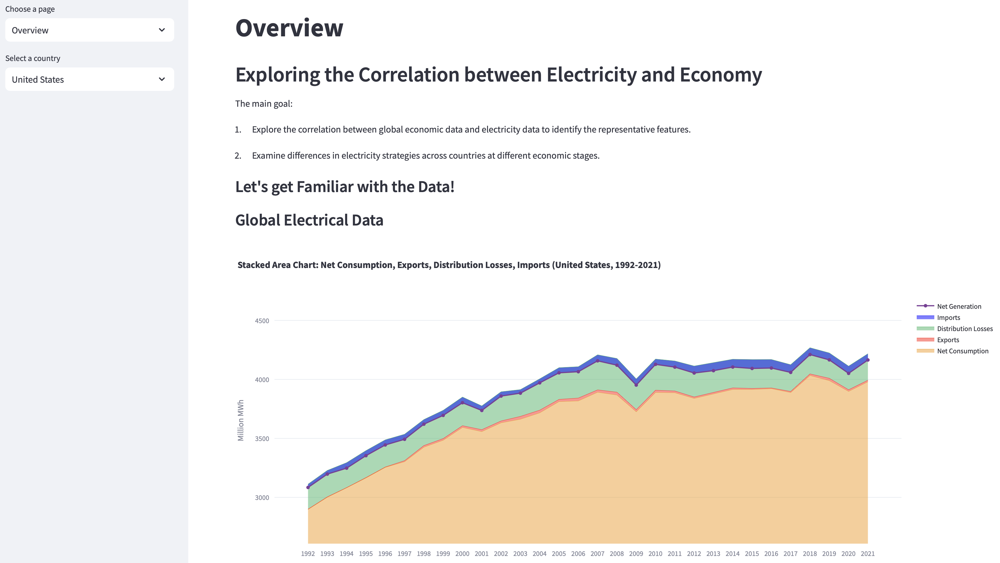

# CMSE830 Final Project (Processing)

## Predicting Economic Indicators from Electricity and Population Data

### Project Overview

The primary goal of this project is to develop a predictive model that can accurately estimate economic indicators, particularly GDP, using electricity and population data from 1992 to 2021. Beyond merely exploring correlations, this project focuses on identifying and excluding confounding or low-relevance features, aiming to construct a streamlined, accurate model. The project also investigates the varying electricity strategies of countries at different stages of economic development and their impact on GDP.

Key objectives include:

- Building a high-dimensional regression model to predict GDP from electricity and population data.
- Using feature selection and dimensionality reduction to eliminate confounding or irrelevant features. Developing a model that balances accuracy with simplicity.
- Exploring whether different electricity strategies (self-sufficiency, importer, exporter) correlate with economic development stages and contribute to the predictive model.

This analysis aims to provide insights into how economic and energy dynamics shape national and regional strategies.

### Datasets

This project utilizes the following datasets:

**1. World GDP(GDP, GDP per capita, and annual growths):**

https://www.kaggle.com/datasets/zgrcemta/world-gdpgdp-gdp-per-capita-and-annual-growths

GDP data is gathered from World Bank. More than +200 country GDP is used between the years 1960-2020.

**2.	Global Electricity Statistics (1980-2021):**

https://www.kaggle.com/datasets/akhiljethwa/global-electricity-statistics

This dataset contains detailed statistics on global electricity production, with a focus on the different sources of electricity, including fossil fuels and renewables. It also provides insights into energy generation capacity and total electricity consumption by country.

**3.  World Population Dataset:**

https://www.kaggle.com/datasets/iamsouravbanerjee/world-population-dataset

Population data encompasses total population, growth rate, and global population share for each country, serving as potential predictive features alongside electricity data.

### Key Features (Processing)

- Included IDA and EDA, with data restructuring and format adjustments.
- Conducted data cleaning and applied linear imputation, along with MAR and MCAR analysis.
- Employed feature selection methods to exclude low-relevance and confounding features.
- Applied dimensionality reduction (e.g., PCA) to create a parsimonious model.
- Implement machine learning models: 

- Grouped countries into low, middle, and high-income categories and analyzed electricity strategies in each group.
- Examined complementary electricity characteristics between neighboring countries.

### Usage

This project is implemented using [Streamlit](https://streamlit.io/), allowing users to interact with the simulation data and explore various scenarios. The app provides real-time visualizations and analysis tools to help users identify the most efficient computational strategies for their specific needs.

### Conclusion (Processing)
Most countries adopt a self-sufficient electricity strategy, particularly among the very large and very small economies. Exporting countries within low- and middle-income brackets tend to have relatively higher per capita electricity infrastructure and generation capacity, along with higher distribution losses. This distinction is less evident among high-income nations.

Self-sufficient countries show a more balanced economic distribution. In these countries, high-income nations make up a larger share, though their income median is lower, while low-income nations form a smaller share but have a higher income median.

Regional electricity complementarity often appears among lower-income countries, with one country relying on its neighbor’s power supply. However, the Nordic countries are an exception, showing flexibility and frequency in switching between importer and exporter roles.

### AI Usage
Almost all the code was completed by ChatGPT-4o Canvas. My job is to explain the logic and functionality of the code in human language and check for errors in the code for correction.

Even the parts I wrote myself heavily relied on Copilot in VSCode for code completion. 

Without AI assistance, I could still complete the project, but it would be impossible to write so much code in such a short amount of time.

