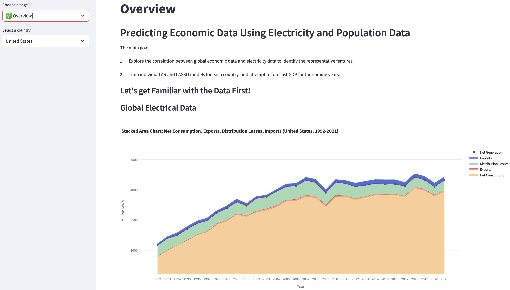
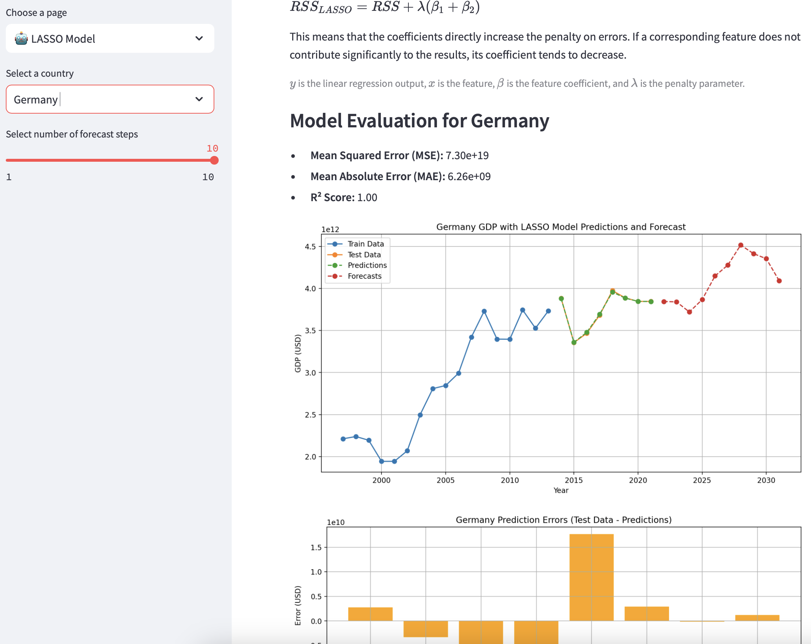

# CMSE830 Final Project (2024 Fall)

## Predicting Economic Data Using Electricity and Population Data

### Project Overview

**1. Midterm Phase: Correlation Analysis**

- Explored the correlation between electricity data and economic data.

**2. Final Phase: Model Training and Prediction**

- Trained AR and LASSO models separately for each country using parallel computing.

### Datasets

This project utilizes the following datasets:

**1. World GDP (GDP, GDP per capita, and annual growths):**

https://www.kaggle.com/datasets/zgrcemta/world-gdpgdp-gdp-per-capita-and-annual-growths

GDP data is gathered from World Bank. More than +200 country GDP is used between the years 1960-2020.

**2. Global Electricity Statistics (1980-2021):**

https://www.kaggle.com/datasets/akhiljethwa/global-electricity-statistics

This dataset contains detailed statistics on global electricity production, with a focus on the different sources of electricity, including fossil fuels and renewables. It also provides insights into energy generation capacity and total electricity consumption by country.

**3.  World Population Dataset:**

https://www.kaggle.com/datasets/iamsouravbanerjee/world-population-dataset

Population data encompasses total population, growth rate, and global population share for each country, serving as potential predictive features alongside electricity data.

### Key Features

- Included IDA and EDA, with data restructuring and format adjustments.
- Conducted data cleaning and applied linear imputation, along with MAR and MCAR analysis.
- Employed feature selection methods to exclude low-relevance and confounding features.
- Applied dimensionality reduction (e.g., PCA) to create a parsimonious model.
- Automated selection of the optimal p-value (minimizing MSE) and features for models, with batch training for 170 countries using parallel computing.

### Usage

This project is implemented using [Streamlit](https://cmse830-xh.streamlit.app), allowing users to interact with the simulation data and explore various scenarios. The app provides real-time visualizations and analysis tools to help users identify the most efficient computational strategies for their specific needs.

### AI Usage
Almost all the code was completed by ChatGPT-4o and GPT-o1. My job is to explain the logic and functionality of the code in human language and check for errors in the code for correction.

Without AI assistance, I could still complete the project, but it would be impossible to write so much code in such a short amount of time.
